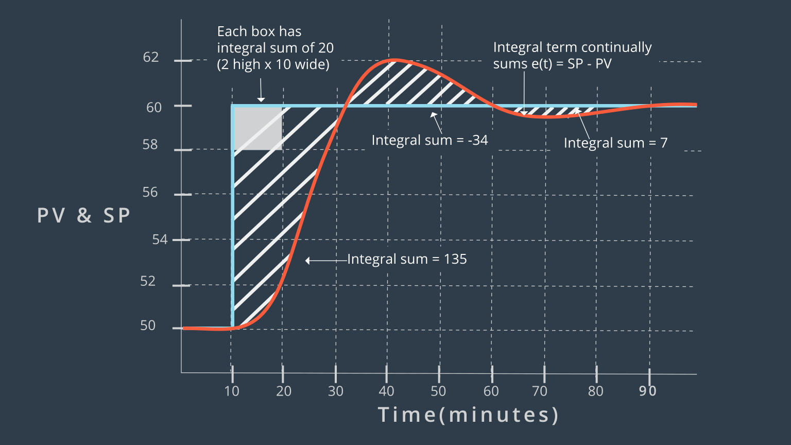
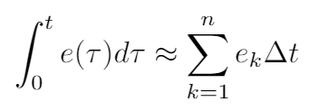
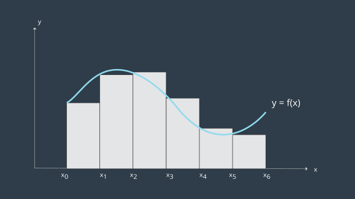
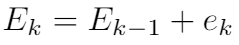
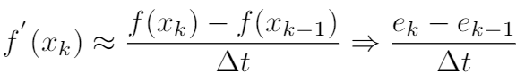
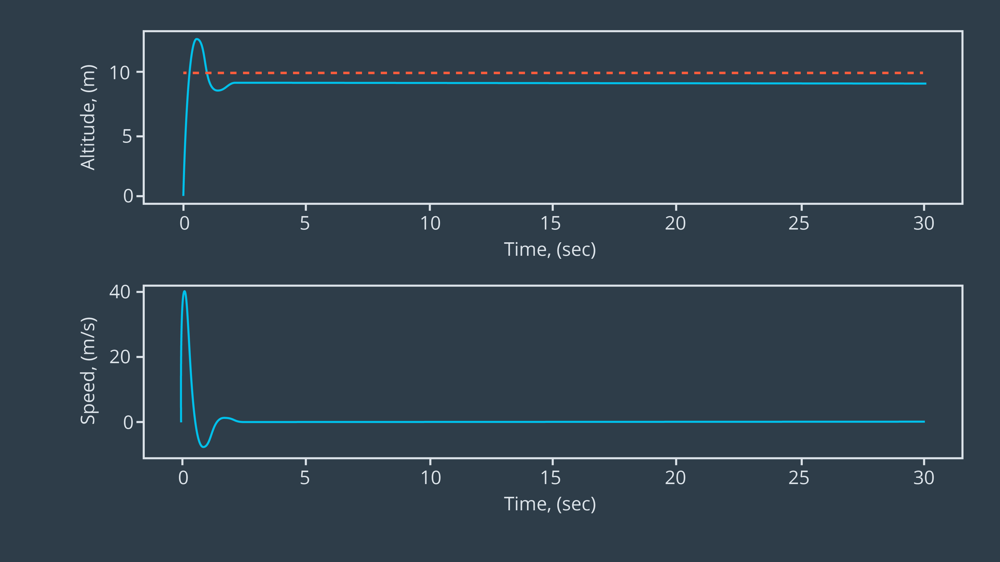
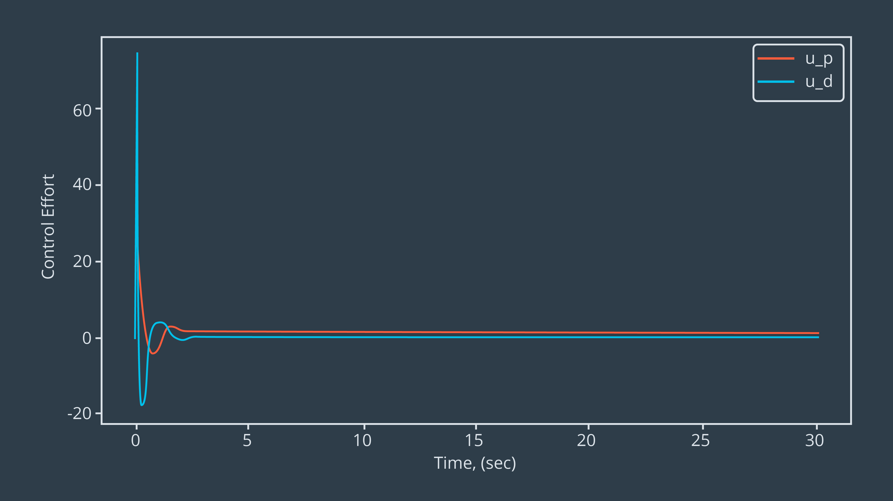

# PID Controller
Design and Understand the basics of a PID Controller using Python

---

## Building a P Controller
**Programming a Proportional Controller**

---

## Building a PI Controller
**Programming a Proportional-Integral Controller**

The proportional controller alone is not adequate to reduce the **Steady State Error(SSE)**. It can be done with help of adding an integral controller.

The basic idea is to increase the control input in relation to the total accumulated error. Thus, the integral controller takes into consideration all past system error values. The net effect is that even small errors will (eventually) be amplified and cause the controller to increase its input to the plant. This way, an integral controller can eliminate the small steady-state error that our proportional controller was prone to.

PV = Process Variable (i.e., measured output)
SP = Set Point (reference signal)

After all, computers are discrete-time devices. Clearly, discrete-time approximations for the integral is needed.
  
The “height” of the rectangle is error at each time point (ek) and the width is the time interval, Δt.

 

At each new time-step, all you have to do is compute the new error and add that to the running sum, i.e.,
  
Adding integral gain can act to smooth certain types of noise (i.e., fluctuating around a zero-mean value). However, like the proportional gain, you cannot make the integral gain arbitrarily large without consequence. If K_i is too large overcompensation can lead to instability through oscillations of increasing magnitude.

---

## Building a PD Controller
**Programming a Proportional-Differential Controller**

The addition of integral gain minimised SSE, but this increased settling time and percent overshoot.  
The derivative term attempts to “predict” what the error will be by linearly extrapolating the change in error value, i.e. it looks to future values (recall that the finite difference approximation of the derivative is the slope of the tangent line). By taking into account the rate of change in the error, the system can more gracefully and rapidly approach the setpoint.  
The derivative of a function represents the slope of the tangent line evaluated at a particular point. It is possible then to approximate the slope with a single-step backwards difference formula,

 

**Result Ouput of designed PD Controller**

